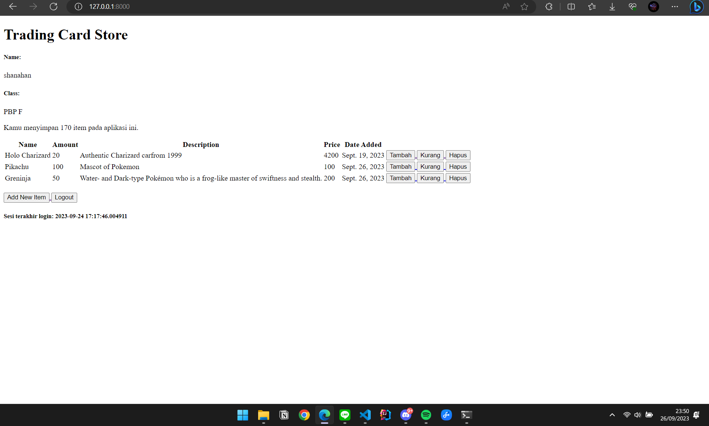

- [Tugas 2](#tugas-2-pbp)
- [Tugas 3](#tugas-3-pbp)
- [Tugas 4](#tugas-4-pbp)
- [Tugas 5](#tugas-5-pbp)
- [Tugas 6](#tugas-6-pbp)


# Tugas 2 PBP

Nama            : Shanahan Danualif Erwin

Kelas           : PBP F

Link Adaptable  : https://hanshop.adaptable.app/

Link PBP        : http://shanahan-danualif-tugas.pbp.cs.ui.ac.id/

1. Jelaskan bagaimana cara kamu mengimplementasikan checklist di atas secara step-by-step (bukan hanya sekadar mengikuti tutorial).
- Membuat sebuah proyek Django baru.

Untuk membuat sebuah proyek Django baru, sebaiknya kita menjalankan sebuah _virtual environment_ terlebih dahulu untuk mencegah terjadi konfilk proyek Django dengan proyek yang lain. Kita bisa menjalankan perintah __"python -m venv env"__ di terminal untuk membuat virtual environment. Kemudian jalankan __"env\Scripts\activate.bat"__ untuk mengaktifkannya. Kita sebaiknya menggunakan Command Prompt saja sebagai terminal karena di PowerShell tidak bisa mengaktifkan _virtual environment_.

Selanjutnya kita akan meng-_install_ _dependencies_ __django, gunicorn, whitenoise, psycopg2-binary, requests, urllib3__ agar proyek dapat berfungsi dengan baik. Kita akan membuat file __requirements.txt__ dalam direktori yang sama dan kita isi dengan _dependencies_ yang dibutuhkan. Kemudian jalankan perintah  __"pip install -r requirements.txt"__ di terminal untuke meng-_install_. Setelah itu, kita dapat menjalankan perintah __"django-admin startproject hanshop .""__ untuk membuat proyek Django dengan nama hanshop. Perlu diingat "hanshop" adalah nama proyek Django saya dan dapat diganti sesuai keinginan kita.

Agar kita dapat _deploy_ proyek kita kepada _web hosting_, kita akan mengganti text yang ada pada __settings.py__. Kita akan menambahkan tanda * pada __ALLOWED_HOSTS__ agar proyek mengizinkan akses dari semua _host_. Nanti tampilan __ALLOWED_HOSTS__ pada setting.py akan menjadi 
__ALLOWED_HOSTS = ["*"]__. Dengan demikian, proyek Django berhasil dibuat. Sebagai catatan sebaiknya kita selalu memakai _virtual environment_ saat menggunakan Django. 
 
- Membuat aplikasi dengan nama main pada proyek tersebut.

Sebelum membuat aplikasi, pastikan virtual environment kita sudah menyala seperti yang sudah dijelaskan pada poin sebelumnya. Kemudian kita akan menjalankan perintah __"python manage.py startapp main"__ dalam direktori proyek django kita. Perintah ini akan membuat aplikasi dengan direktori baru yang bernama __main__ yang menjadi struktur awal aplikasi Django.

- Melakukan routing pada proyek agar dapat menjalankan aplikasi main.

Setelah app __main__ sudah terbentuk, kita harus menghubungkan aplikasi ke dalam proyek Django kita. Kita dapat menghubungkannya dengan cara membuka berkas settings.py yang berada dalam direktori proyek Django. Kemudian kita akan menambahkan __"main"__ ke dalam variabel __INSTALLED_APPS__. Hasil akhir kodenya akan terlihat seperti ini 
__"INSTALLED_APPS = ['main']__"(jangan menghapus daftar aplikasi __INSTALLED_APPS__ yang sudah ada)

- Membuat model pada aplikasi main dengan nama Item dan memiliki atribut wajib sebagai berikut.
  - name sebagai nama item dengan tipe CharField
  - amount sebagai jumlah item dengan tipe IntegerField
  - description sebagai deskripsi item dengan tipe TextField.

Untuk membuat model pada aplikasi __main__, kita akan membuka models.py dan mengisi kode seperti berikut:
````
from django.db import models

class Product(models.Model):
    name = models.CharField(max_length=255)
    amount = models.IntegerField()
    description = models.TextField()
    price = models.IntegerField()
````
Pada line 1 kita akan meng-_import_ module model dari django. Kemudian pada line 3-6 kkita membuat sebuah model bernama Product dengan field name, amount, description, dan price. Tiap field mempunyai tipe data yang sesuai dengan kebutuhan nama fieldnya. Untuk name kita memakai CharField yang cocok untuk menyimpan text dengan panjang 255 karakter. Untuk amount dan price kita memakai Integer Field untuk menyimpan angka apapun asalkan masih dalam range Integer. Untuk description kita memakai TextField yang cocok untuk menyimpan teks panjang seperti sebuah paragraf karena tidak ada panjang karakter maksimum.

Selanjutnya kita akan melakukan migrasi model dengan menjalankan perintah __"python manage.py makemigrations"__ diikuti __"python manage.py migrate"__ untuk melakukan migrasi model ke dalam basis data lokal. Tiap kali ada perubahan dalam model, kita harus melakukan migrasi ini agar perubahan tersebut tercatat.

- Membuat sebuah fungsi pada views.py untuk dikembalikan ke dalam sebuah template HTML yang menampilkan nama aplikasi serta nama dan kelas kamu.

Pertama, buatlah direktori baru bernama __templates__ dalam direktori __main__. Kemudian kita buat berkas __main.html__ yang akan kita isi dengan koding sebagai berikut:
````
<h1>Inventory List Page</h1>

<h5>Nama aplikasi: </h5>
<p>{{app_name}}<p>
<h5>Nama: </h5>
<p>{{nama_mahasiswa}}</p><p>
<h5>Kelas: </h5>
<p>{{class_name}}<p>
````
Kode berikut adalah kode untuk menampilkan app_name, nama_mahasiswa, dan class_name untuk aplikasi kita. Kita memakai double curly braces seperti ini __{{ ... }}__ untuk menyimpan variabel yang valuenya kita masukkan di __views.py__. 

Bukalah views.py yang berada dalam direktori kemudian kita akan membuat fungsi seperti ini:
````
def show_main(request):
    context = {
        'app_name': 'Han Shop',
        'nama_mahasiswa': 'Shanahan Danualif Erwin',
        'class_name': 'PBP F',
    }
    return render(request, "main.html", context)
````
Dalam fungsi ini terdapat dictionary untuk menyimpan value app_name, nama_mahasiswa, dan class_name kita. Kita juga menggunakan __render__ yang berfungsi untuk me-_render_ tampilan __main.html__ kita.

Selanjutnya buatlah file __urls.py__ dalam direktori main. file __urls.py__ ini akan mengonfigurasi routing untuk aplikasi __main__ kita. Kita akan menambahkan koding seperti ini:
````
from django.urls import path
from main.views import show_main

app_name = 'main'

urlpatterns = [
    path('', show_main, name='show_main'),
]
````
Disini kita meng-_import_ module __path__ untuk mendefinisikan pola URL kita dan __show_main__ dari __main.views__ yang sudah kita buat. Kemudian pada line 4 kita menetapkan namespace __main__ sebagai konfigurasi URL ini agar tidak ada konflik dengan aplikasi berbeda. Terlihat pada line 7 nanti fungsi __show_main__ akan dipanggil ketika URL diakses.

Setelah itu kita akan membuka file __urls.py__ dalam direktori proyek. Kita akan mengimpor fungsi __include__ seperti ini ````from django.urls import path, include```` untuk mengimpor URL dari aplikasi main ke urls.py dalam direktori proyek. Kemudian tambahkan rute URL seperti ini:
````
urlpatterns = [
    ...
    path('main/', include('main.urls')),
    ...
]
````
Kode ini membuat path __main/__ akan diarahkan ke urls.py yang berada dalam aplikasi __main__

Dengan demikian, akan terlihat tampilan HTML yang kita inginkan beserta value yang sdah kita atur di views setelah melakukan routing ini.

2. Buatlah bagan yang berisi request client ke web aplikasi berbasis Django beserta responnya dan jelaskan pada bagan tersebut kaitan antara urls.py, views.py, models.py, dan berkas html.


Alurnya pertama client akan meminta request yang diarahkan ke urls.py. Disini pola URL di urls.py akan dicocokkan dengan URL yang diterima kemudian urls.py akan memilih fungsi view sesuai request dari user. Selanjutnya View akan melakukan query ke model dimana model dapat melakukan transaksi data dengan database untuk mendapatkan data yang sesuai. Model kemudian akan mengirim _respond data_ ke view kembali yang dilanjutkan dengan view memilih template HTML yang sesuai dengan permintaan client. Terakhir, template yang telah dipilih akan ditampilkan ke pengguna dari halaman web

3. Jelaskan mengapa kita menggunakan virtual environment? Apakah kita tetap dapat membuat aplikasi web berbasis Django tanpa menggunakan virtual environment?

Kita menggunakan virtual environment agar proyek Django yang sedang kita jalankan terisolasi dari proyek lain. Hal ini sangat penting agar _dependencies_ yang kita _install_ hanya digunakan untuk proyek itu saja. Hal ini juga bermanfaat agar tiap proyek bisa mempunyai _dependencies_ masing-masing. Selain itu, kita bisa mengatur versi dari python atau package yang kita gunakan agar sesuai dengan kebutuhan proyek kita. Selain itu, dengan virtual environment proyek kita bisa lebih portable sehingga jika ada orang lain yang ingin menggunakan proyek kita, mereka dapat membuat virtual environment saja kemudian meng-_install_ dependencies yang dibutuhkan tanpa khawatir terjadi konflik pada komputernya.

Kita tetap bisa menjalankan aplikasi berbasis Django tanpa menggunakan virtual environment. Namun banyak sekali masalah yang dapat terjadi jika kita tidak menggunakan virtual environment yang dapat menghambat pengembangan aplikasi kita. Contohnya seperti jika terjadi perbedaan versi antara python yang ada di lingkungan global dengan versi Python yang digunakan pada Django akan membuat masalah karena beda versinya. Tentu saja lebih mudah untuk mengaktifkan virtual environment dan mengunduh versi Django sesuai kebutuhan kita.


4. Jelaskan apakah itu MVC, MVT, MVVM dan perbedaan dari ketiganya.

- MVC (Model-View_Controller) 
    - Model: Model disini berfungsi untuk mengelola data dan berhubungan langsung dengan _database_
    - View: bagian yang bertanggung jawab untuk menampilkan informasi atau data kepada pengguna
    - Controller: sebagai perantara Model dan View dalam setiap proses request dari user.

- MVT (Model-View-Template)
    - Model: Bagian yang bertanggung jawab mengatur dan mengelola data dari aplikasi
    - View: Komponen yang mengatur bagaimana data yang dikelola akan ditampilkan kepada pengguna
    - Template: Komponen yang berperan sebagai tampilan yang dikembalikan kepada pengguna

- MVVM(Model-View-ViewModel)
    - Model: Bertanggung jawab untuk mengambil dan menyimpan data serta memproses data yang diperlukan
    - View: Mewakili representasi visual dari data yang ditampilkan ke pengguna
    - ViewModel: Berperan sebagai jembatan antara Model dan View, bertanggung jawab untuk menyimpan status tampilan dan menjalankan operasi yang diperlukan untuk mengubah data dalam Model ke format yang dapat ditampilkan.

 - Perbedaan yang dapat terlihat dari ketiga arsitektur ini adalah cara interaksi antara komponen-komponennya. Pada MVC kita menggunakan Controller untuk mengatur alur aplikasi. Sedangkan MVT merupakan turunan dari struktur MVC dimana View yang berperan sebagai jembatan antara Model, Template dan Template berfungsi sebagai tampilan untuk pengguna menggantikan peran View pada MVC, dan Model berfungsi mengolah data mengelola data pada aplikasi seperti pada MVT. Terakhir untuk MVVM yang berperan sebagai jembatan antara Model dan View adalah ViewModelnya, sedangkan Model dan Viewnya berfungsi seperti pada MVC.

# Tugas 3 PBP

1. Apa perbedaan antara form POST dan form GET dalam Django?
- GET
    - Biasa digunakan untuk mengirim data-data tidak penting
    - Untuk mengirim permintaan ke server tertentu guna mendapatkan data atau sumber daya tertentu.
    - Nilai variabel ditampilkan di URL sehingga user dapat memasukkan nilai variabel baru, tetapi tidak terlalu aman
- POST
    - Digunakan untuk mengirim data-data sensitif seperti password
    - Untuk mengirimkan data ke server guna membuat atau memperbarui data tertentu.
    - Nilai variabel tidak terekspos di URL jadi lebih aman


2. Apa perbedaan utama antara XML, JSON, dan HTML dalam konteks pengiriman data?

- XML (eXtensible Markup Language)
    - Format file untuk menyimpan data dengan cara yang terstruktur, tetapi tidak efisien
    - Lebih kompleks dan ukuran filenya lebih besar dari JSON
    - Pilihan utama untuk mentransmisikan data terstruktur melalui web.


- JSON (JavaScript Object Notation)
    - Format file untuk menyimpan data secara efisien, tetapi tidak rapi untuk dilihat
    - Sintaks yang lebih ringan dan berukuran lebih kecil.
    - Cocok sebagai media penyimpanan untuk aplikasi web karena kesederhanaannya.

- HTML (Hypertext Markup Language)
    - Format file yang digunakan untuk menampilkan konten web. Jadi HTML ini khusus untuk menampilkan tampilan web ke mata pengguna


3. Mengapa JSON sering digunakan dalam pertukaran data antara aplikasi web modern?

Alasan utamanya adalah format JSON yang lebih sederhana dan ringkas. Hal ini menyebabkan JSON dapat ditransmisikan lebih cepat melalui jaringan serta pemrosesan data menjadi lebih cepat dibanding menggunakan XML. Oleh karena itu, JSON sangat cocok digunakan untuk pertukaran data antara aplikasi web modern


4. Jelaskan bagaimana cara kamu mengimplementasikan checklist di atas secara step-by-step (bukan hanya sekadar mengikuti tutorial).


- Membuat input form untuk menambahkan objek model pada app sebelumnya.

Untuk membuat input form, pertama-tama kita harus membuat direktori yang bernama _templates_ pada direktori root kemudian kita isi dengan berkas base.html. FIle html ini akan menjadi template dasar projek kita dengan kodingan:
````

<!DOCTYPE html>
<html lang="en">
    <head>
        <meta charset="UTF-8" />
        <meta
            name="viewport"
            content="width=device-width, initial-scale=1.0"
        />
        
        
    </head>

    <body>
        
        
    </body>
</html>
````

Selanjutnya, kita akan mengubah _settings.py_ yang berada dalam direktori hanshop. Carilah TEMPLATES kemudian tambahkan __'DIRS': [BASE_DIR / 'templates'],__ agar dapat terhubung dengan base.html yang telah dibuat. Kode akhir akan terlihat seperti ini:
````
...
TEMPLATES = [
    {
        'BACKEND': 'django.template.backends.django.DjangoTemplates',
        'DIRS': [BASE_DIR / 'templates'], # perubahan disini
        'APP_DIRS': True,
        ...
    }
]
...
````
Bukalah file __main.html__ dalam folder main/templates dan ubahlah kode menjadi berikut:
````



    <h1>Trading Card Store</h1>

    <h5>Name:</h5>
    <p>{{name}}</p>

    <h5>Class:</h5>
    <p>{{class}}</p>

````
Kode diatas menggunakan __base.html__ sebagai template utama kita. Setelah kita melakukan setup skeleton sebagai kerangka views, kita akan memulai membuat form input data. Buatlah file __forms.py__ dalam direktori main untuk membuat struktur form yang dapat menerima data produk baru. Isi kodingannya:
````
from django.forms import ModelForm
from main.models import Item

class ItemForm(ModelForm):
    class Meta:
        model = Item
        fields = ["name", "amount" , "description", "price"]
````
Kemudian, kita membuka file _views.py_ dalam direktori main yang kita tambahkan import modulnya dan kita edit fungsi __create_item__ untuk menambahkan data produk secara otomatis ketika form di-submit. Kodingannya seperti ini:
````
from django.http import HttpResponseRedirect
from main.forms import ProductForm
from django.urls import reverse

def create_item(request):
    form = ItemForm(request.POST or None)

    if form.is_valid() and request.method == "POST":
        form.save()
        return HttpResponseRedirect(reverse('main:show_main'))

    context = {'form': form}
    return render(request, "create_item.html", context)
````

Selanjutnya, kita menambahkan path URL dalam __urls.py__ dalam direktori main. Caranya dengan mengisi kode berikut:
````
from main.views import show_main, create_item
...
urlpatterns = [
    ...
    path('create-item', create_item, name='create_item'),
]
````
Selanjutnya kita akan mengedit file html yang ada di direktori main/templates. Pertama buatalah file baru bernama __create_item.html__ yang diisi dengan:
````
 


<h1>Add New Item</h1>

<form method="POST">
    
    <table>
        {{ form.as_table }}
        <tr>
            <td></td>
            <td>
                <input type="submit" value="Add Item"/>
            </td>
        </tr>
    </table>
</form>


````
Kode ini digunakan agar pengguna dapat mengisi form dan di-submit sesuai fields yang sudah dibuat pada model. Setelah itu, bukalah main.html yang berada dalam direktori main/templates yang kita tambahkan dengan kode:
````
...
<table>
    <tr>
        <th>Name</th>
        <th>Price</th>
        <th>Description</th>
        <th>Date Added</th>
    </tr>

     Berikut cara memperlihatkan data produk di bawah baris ini 

    
        <tr>
            <td>{{product.name}}</td>
            <td>{{product.price}}</td>
            <td>{{product.description}}</td>
            <td>{{product.date_added}}</td>
        </tr>
    
</table>

<br />

<a href="">
    <button>
        Add New Product
    </button>
</a>


````
Kode ini akan menampilkan data produk dalam bentuk tabel serta tombol "Add New Item" yang kalau diklik akan redirect user ke halaman form.


- Tambahkan 5 fungsi views untuk melihat objek yang sudah ditambahkan dalam format HTML, XML, JSON, XML by ID, dan JSON by ID.
Sebelum kita membuat fungsi views yang kita inginkan, importlah modul-modul ini terlebih dahulu karena dibutuhkan oleh fungsi views yang kita ingin buat dalam file views.py dalam folder main
````
from django.shortcuts import render
from main.models import Item
from django.http import HttpResponse
from django.core import serializers
````
Selanjutnya kita akan memulai membuat fungsi views yang kita inginkan. Kita akan mengedit __views.py__ dalam direktori main untuk membuat fungsi-fungsinya. Untuk melihat objek yang sudah kita tambahkan, ubahlah kode show_main dengan menambahkan __items = Item.objects.all()__ yang dapat mengambil seluruh object Item yang tersimpan di database. Kode fungsinya akan seperti ini:
````
def show_main(request):
    items = Item.objects.all()

    context = {
        'name': 'Shanahan Danualif Erwin', # Nama kamu
        'class': 'PBP F', # Kelas PBP kamu
        'items': items
    }

    return render(request, "main.html", context)
````
Untuk melihat objek yang kita inginkan dalam format XML, buatlah fungsi show_xml seperti berikut:
````
def show_xml(request):
    data = Item.objects.all()
    return HttpResponse(serializers.serialize("xml", data), content_type="application/xml")
````
Jika ingin melihat data-data yang kita tambahkan berdasarkan id yang kita inginkan dalam format XML, tambahkan fungsi show_xml_by_id seperti ini:
````
def show_xml_by_id(request, id):
    data = Item.objects.filter(pk=id)
    return HttpResponse(serializers.serialize("xml", data), content_type="application/xml")
````
Untuk melihat objek yang kita inginkan dalam format JSON, buatlah fungsi show_xml seperti berikut:
````
def show_json(request):
    data = Item.objects.all()
    return HttpResponse(serializers.serialize("json", data), content_type="application/json")
````

Jika ingin melihat data-data yang kita tambahkan berdasarkan id yang kita inginkan dalam format JSON, tambahkan fungsi show_json_by_id seperti ini:
````
def show_json_by_id(request, id):
    data = Item.objects.filter(pk=id)
    return HttpResponse(serializers.serialize("json", data), content_type="application/json")
````

- Membuat routing URL untuk masing-masing views yang telah ditambahkan pada poin 2.

Bukalah __urls.py__ yang berada dalam direktori main dan tambahkan pathing berikut:
````
from main.views import show_main, create_item, show_xml, show_json, show_xml_by_id, show_json_by_id

app_name = 'main'

urlpatterns = [
    path('', show_main, name='show_main'),
    path('xml/', show_xml, name='show_xml'), 
    path('xml/<int:id>/', show_xml_by_id, name='show_xml_by_id'),
    path('json/', show_json, name='show_json'),
    path('json/<int:id>/', show_json_by_id, name='show_json_by_id'), 
    ....
]
````

- Mengakses kelima URL di poin 2 menggunakan Postman, membuat screenshot dari hasil akses URL pada Postman, dan menambahkannya ke dalam README.md.


# Tugas 4 PBP

-Apa itu Django UserCreationForm, dan jelaskan apa kelebihan dan kekurangannya?

Django UserCreationForm adalah _form_ yang sudah disediakan oleH Django agar pengguna dapat membuat _form_ dengan mudah Kelenihannya antara lain
    - Mudah digunakan oleh pengguna Django karena sudah disediakan secara built-in oleh Django
    - Sudah ada validasi password yang terintegrasi secara langsung, seperti _password_ yang sudah diberi ketentuan agar tidak terlalu mirip dengan _username_
    - Penggungan dapat mudah melakukan kustomisasi terhadap _form_ yang ada pada form Django sesuai kebutuhan


-Apa perbedaan antara autentikasi dan otorisasi dalam konteks Django, dan mengapa keduanya penting?

Autentikasi dan otorisasi penting untuk mengatur akses pengguna ke bagian-bagian aplikasi web yang dibuat dalam Django Perbedaanya:
    -Autentikasi
        - Proses verifikasi identitas pengguna, biasanya emakai _username_ dan _password_
        - Tujuannya untuk memastikan pengguna yang login adalah pengguna yang sah
        - Contohnya seperti UserCreationForm dalam Djang0 untuk membuat form bagi pengguna

    -Otorisasi
        - Proses untuk menentukan apa yang boleh dilakukan pengguna yang sudah terautentikasi. Misalnya data item yang ada pada tabel di Han Shop hanya milik pengguna saja yang ditampilkan
        - Untuk memastikan pengguna hanya memiliki akses ke halaman atau data yang sesuai
        -Contoh implementasinya seperti @login_required untuk membatasi akses ke tampilan tertentu hanya untuk pengguna yang telah login


-Apa itu cookies dalam konteks aplikasi web, dan bagaimana Django menggunakan cookies untuk mengelola data sesi pengguna?

Cookies adalah data kecil yang dikirim oleh server web ke browser saat ada yang mengakses website. Data ini akan dipakai lagi ketika pengguna mengakses website tersebut. Ada dua cara untuk menyimpan cookie, yaitu session cookie dan persistent cookie

Session cookie atau temporary cookie berarti cookie akan disimpan ke memori browser dan akan hilang saat browser ditutup. Cookie ini biasanya lebih aman karena hanya browser yang dapat mengakses cookie tersebut. Kedua adalah persisten cookie yang disimpan sebagai file dalam komputer. Cookie jenis ini bisa lebih berbahaya karena dapat melacak informasi pengguna secara jarak panjang


-Apakah penggunaan cookies aman secara default dalam pengembangan web, atau apakah ada risiko potensial yang harus diwaspadai?

Penggunaan cookies bisa menjadi alat yang aman, tetapi terdapat risiko potensial yang harus diwaspadai oleh pengguna. Walaupun Django sudah mempunyai fitur keamanan seperti perlindungan CSRF, tapi tidak ada aplikasi yang sepenuhnya bebas dari risiko. Contohnya seperti ancaman Cookie poisoning dimana penyerang me-_modify_ data dari cookie untuk mendapatkan _unauthorized access_

-Jelaskan bagaimana cara kamu mengimplementasikan checklist di atas secara step-by-step (bukan hanya sekadar mengikuti tutorial).

Sebelum melakukan checkpoint, pastikan untuk mengaktifkan virtual envionment terlebih dahulu agar proyek Django dapat terisolasi.

    -Mengimplementasikan fungsi registrasi, login, dan logout untuk memungkinkan pengguna untuk mengakses aplikasi sebelumnya dengan lancar.

Pertama, bukalah __views.py__ yang berada dalam direktori main dan imporlah beberapa modul dan membuat fungsi register
````
from django.shortcuts import redirect
from django.contrib.auth.forms import UserCreationForm
from django.contrib import messages 

def register(request):
    form = UserCreationForm()

    if request.method == "POST":
        form = UserCreationForm(request.POST)
        if form.is_valid():
            form.save()
            messages.success(request, 'Your account has been successfully created!')
            return redirect('main:login')
    context = {'form':form}
    return render(request, 'register.html', context)
````
Modul-modul yang diimpor dibutuhkan untuk membuat fungsi register. Fungsi register memanfaatkan django UserCreationForm untuk membuat form yang dapat melakukan fungsi register

Kemudian, buatlah file register.html di dalam direktori main/templates. File ini akan menampilkan template sesuai kode ini:
````



    <title>Register</title>


  

<div class = "login">
    
    <h1>Register</h1>  

        <form method="POST" >  
              
            <table>  
                {{ form.as_table }}  
                <tr>  
                    <td></td>
                    <td><input type="submit" name="submit" value="Daftar"/></td>  
                </tr>  
            </table>  
        </form>

      
        <ul>   
              
                <li>{{ message }}</li>  
                  
        </ul>   
    

</div>  


````
Kemudian buatlah fungsi login_user di file views.py dalam direktori main yang berfungsi untuk autentikasi pengguna dengan kode seperti berikut:
````
from django.contrib.auth import authenticate, login

def login_user(request):
    if request.method == 'POST':
        username = request.POST.get('username')
        password = request.POST.get('password')
        user = authenticate(request, username=username, password=password)
        if user is not None:
            login(request, user)
            return redirect('main:show_main')
        else:
            messages.info(request, 'Sorry, incorrect username or password. Please try again.')
    context = {}
    return render(request, 'login.html', context)
````
Selanjutnya, buatlah file login.html di direktori main/templates untuk menampilkan halaman login dengan kode seperti ini
````



    <title>Login</title>




<div class = "login">

    <h1>Login</h1>

    <form method="POST" action="">
        
        <table>
            <tr>
                <td>Username: </td>
                <td><input type="text" name="username" placeholder="Username" class="form-control"></td>
            </tr>
                    
            <tr>
                <td>Password: </td>
                <td><input type="password" name="password" placeholder="Password" class="form-control"></td>
            </tr>

            <tr>
                <td></td>
                <td><input class="btn login_btn" type="submit" value="Login"></td>
            </tr>
        </table>
    </form>

    
        <ul>
            
                <li>{{ message }}</li>
            
        </ul>
         
        
    Don't have an account yet? <a href="">Register Now</a>

</div>


````
Setelah itu, buatlah fungsi logout_user untuk me-logout pengguna dengan beberapa import modul seperti kode dibawah ini:
````
from django.contrib.auth import logout

def logout_user(request):
    logout(request)
    return redirect('main:login')
````
Kemudian tambahkan potongan kode ini di main.html dalam main/templates untuk membuat tombol logout
````
...
<a href="">
    <button>
        Logout
    </button>
</a>
...
````
Selanjutnya kita akan membuat routingnya dengan membuka file urls.py kemudian kita tambahkan potongan kode ini:

````
from main.views import register, login_user, logout_user

urlpatterns = [
    ...
    path('register/', register, name='register'),
    path('login/', login_user, name='login'),
    path('logout/', logout_user, name='logout'),
    ...
]
````


    -Membuat dua akun pengguna dengan masing-masing tiga dummy data menggunakan model yang telah dibuat pada aplikasi sebelumnya untuk setiap akun di lokal.




    -Menghubungkan model Item dengan User.
Bukalah models.py dalam direktori main dan tambahkan kode berikut:
````
from django.contrib.auth.models import User

class Item(models.Model):
    ...
    user = models.ForeignKey(User, on_delete=models.CASCADE)
    ...
````
Kode ini berfungsi untuk menghubungkan satu item dengan satu user. Selanjutnya bukalah views.py dalam direktori main dan ubah potongan kode create_item menjadi seperti ini untuk menandakan objek yang dibuat milik user yang sedang login:

````
def create_item(request):
    form = ItemForm(request.POST or None)

    if form.is_valid() and request.method == "POST":
        item = form.save(commit=False)
        item.user = request.user
        item.save()
        return HttpResponseRedirect(reverse('main:show_main'))
    ...
````
Selanjutnya ubahlah fungsi show_main seperti berikut untuk mem-filter objek yang ditampilkan hanya objek milik user yang login
````
def show_main(request):
    items = Item.objects.filter(user=request.user)

    total_amount = Item.objects.filter(user=request.user).aggregate(total_amount=Sum('amount'))['total_amount']
    if total_amount is None:
        total_amount = 0

    context = {
        'name': request.user.username, # Nama kamu
    ....
````
Kemudian lakukanlah migrasi dengan menjalankan 'python manage.py makemigrations' diikuti dengan 'python manage.py migrate'

    -Menampilkan detail informasi pengguna yang sedang logged in seperti username dan menerapkan cookies seperti last login pada halaman utama aplikasi.

Bukalah views.py dalam direkotri main dan tambahkan kode ini. Kode ini akan merestriksi akses halaman main
````
from django.contrib.auth.decorators import login_required

@login_required(login_url='/login')
def show_main(request):
...
````

Kemudian imporlah beberapa modul berikut kemudian tambahkan kode ini dalam fungsi login_user

````
import datetime
from django.http import HttpResponseRedirect
from django.urls import reverse

def login_user(request):
    if request.method == 'POST':
        username = request.POST.get('username')
        password = request.POST.get('password')
        user = authenticate(request, username=username, password=password)
        if user is not None:
            login(request, user)
            response = HttpResponseRedirect(reverse("main:show_main")) 
            response.set_cookie('last_login', str(datetime.datetime.now()))
            return response
        else:
            messages.info(request, 'Sorry, incorrect username or password. Please try again.')
    context = {}
    return render(request, 'login.html', context)
````

Pada fungsi show_main ubahlah bagian context menjadi seperti ini
````
 context = {
        ...
        'last_login': request.COOKIES['last_login'],
    }

````

Ubah fungsi logout menjadi seperti ini untuk menghapus cookie saat pengguna logout
````
def logout_user(request):
    logout(request)
    response = HttpResponseRedirect(reverse('main:login'))
    response.delete_cookie('last_login')
    return response
````

Kemudian buka berkas main.html dalam main/templates dan tambahkan kode ini untuk menampilkan sesi terakhir login di antara tabel dan tombol logout
````
...
<h5>Sesi terakhir login: {{ last_login }}</h5>
...
````

# Tugas 5 PBP

- Jelaskan manfaat dari setiap element selector dan kapan waktu yang tepat untuk menggunakannya.
    - Element selector: menargetkan elemen HTML berdasarkan nama elemen itu sendiri. Digunakan saat ingin menerapkan style semua elemen tertentu
    - ID selector: menggunakan atribut ID unik dari elemen HTML untuk memilih elemen tertentu. Cocok digunakan untuk menerapkan style pada elemen dengan ID unik tersebut
    - Class selector: menargetkan elemen HTML dengan atribut kelas tertentu. Cocok digunakan untuk memberi style ke elemen di suatu kelas

- Jelaskan HTML5 Tag yang kamu ketahui.

<!DOCTYPE html> biasanya ditempatkan di bagian paling atas untuk menunjukkan penggunaan HTML5 pada halaman.

Tag <html> digunakan untuk mengawali dan mengelilingi semua konten HTML

Tag <head> digunakan untuk informasi umum tentang halaman, seperti judul.

Tag <meta> digunakan untuk menyisipkan informasi tambahan tentang website.

Tag <title> digunakan untuk menentukan judul yang akan ditampilkan di tab browser.

Tag <link> digunakan untuk menghubungkan halaman HTML dengan berkas eksternal, misalnya file CSS.

Tag <style> digunakan agar kode CSS memformat tampilan halaman

Tag <script> untuk menyertakan kode JavaScript.

Tag <body> mengelilingi konten utama halaman web, termasuk teks, gambar, dan tag lain yang akan ditampilkan kepada pengguna.

Tag <p> digunakan untuk menampilkan paragraf

Tag <a> digunakan untuk membuat tautan (hyperlink) ke halaman web lain

Tag  digunakan untuk menampilkan gambar di halaman web

Tag <div> digunakan untuk mengelompokkan sejumlah kode HTML ke dalam blok yang dapat diubah tampilannya dengan CSS

Tag <form> digunakan untuk membuat formulir yang memungkinkan pengguna untuk mengirim data ke server.


- Jelaskan perbedaan antara margin dan padding.
Margin 
Margin menunjuk pada ruang di luar elemen HTML dan mengontrol jarak antara elemen dengan elemen lain di sekitarnya. Kalau padding menunjuk pada ruang yang berada dalam elemen HTML nya segingga mengontrol jarak antara konten elemen dengan batas elemen itu sendiri

- Jelaskan perbedaan antara framework CSS Tailwind dan Bootstrap. Kapan sebaiknya kita menggunakan Bootstrap daripada Tailwind, dan sebaliknya?

Bootstrap merupakan framework CSS yang komponennya sudah built-in, seperti sebuah navbar, card, dan form. User dapat mengkustomisasi komponen tersebut tapi tidak sebebas Tailwind

Tailwind merupakan framework CSS yang membangun tampilan dengan menggabungkan kelas-kelas utilitas yang telah didefinisikan sebelumnya. Tailwind memberi tingkat kustomisasi yang tinggi yang sangat detail sesuai kebutuhan user

Sebaiknya kita menggunakan bootstrap jika ingin membuat website dengan kustomisasi yang tidak terlalu mendalam. Bootstrap juga cocok digunakan untuk pemula karena banyak kompinen built-in nya. Sedangkan, tailwind sebaiknya dipakai jika website ingin dikustomisasi lebih mendalam, tetapi akan membutuhkan waktu memelajari tailwind untuk menggunakannya secara maksimal


- Jelaskan bagaimana cara kamu mengimplementasikan checklist di atas secara step-by-step (bukan hanya sekadar mengikuti tutorial).

    -  Kustomisasi desain pada templat HTML yang telah dibuat pada Tugas 4 dengan menggunakan CSS atau CSS framework (seperti Bootstrap, Tailwind, Bulma) dengan ketentuan sebagai berikut

Bukalah folder templates yang berada pada root directory dan edit kode dalam base.html seperti ini untuk menambahkan bootstrap dan CSS

````
....
 
            <meta charset="UTF-8" />
            <meta name="viewport" content="width=device-width, initial-scale=1">
        
        <link href="https://cdn.jsdelivr.net/npm/bootstrap@5.3.2/dist/css/bootstrap.min.css" rel="stylesheet" integrity="sha384-T3c6CoIi6uLrA9TneNEoa7RxnatzjcDSCmG1MXxSR1GAsXEV/Dwwykc2MPK8M2HN" crossorigin="anonymous">
        <script src="https://code.jquery.com/jquery-3.6.0.min.js" integrity="sha384-KyZXEAg3QhqLMpG8r+J4jsl5c9zdLKaUk5Ae5f5b1bw6AUn5f5v8FZJoMxm6f5cH1" crossorigin="anonymous"></script>
        <script src="https://cdn.jsdelivr.net/npm/@popperjs/core@2.11.8/dist/umd/popper.min.js" integrity="sha384-I7E8VVD/ismYTF4hNIPjVp/Zjvgyol6VFvRkX/vR+Vc4jQkC+hVqc2pM8ODewa9r" crossorigin="anonymous"></script>
        <script src="https://cdn.jsdelivr.net/npm/bootstrap@5.3.2/dist/js/bootstrap.min.js" integrity="sha384-BBtl+eGJRgqQAUMxJ7pMwbEyER4l1g+O15P+16Ep7Q9Q+zqX6gSbd85u4mG4QzX+" crossorigin="anonymous"></script>
    </head>
````

   - Kustomisasi halaman login, register, dan tambah inventori semenarik mungkin.

Buatlah navbar dan margin dengan menambahkan kode ini pada base.html yang berada dalam direktori templates pada root agar file HTML lain yang memakai template dari base.html ini mendapatkan navbar dan margin

````
<body>
       
<!DOCTYPE html>
<html lang="en">
    <head>
        <meta charset="UTF-8" />
        <meta
            name="viewport"
            content="width=device-width, initial-scale=1.0"
        />
        
            <meta charset="UTF-8" />
            <meta name="viewport" content="width=device-width, initial-scale=1">
        
        <style>
            .content-wrapper {
                margin: 20px;
            }
        </style>

        <link href="https://cdn.jsdelivr.net/npm/bootstrap@5.3.2/dist/css/bootstrap.min.css" rel="stylesheet" integrity="sha384-T3c6CoIi6uLrA9TneNEoa7RxnatzjcDSCmG1MXxSR1GAsXEV/Dwwykc2MPK8M2HN" crossorigin="anonymous">
        <script src="https://code.jquery.com/jquery-3.6.0.min.js" integrity="sha384-KyZXEAg3QhqLMpG8r+J4jsl5c9zdLKaUk5Ae5f5b1bw6AUn5f5v8FZJoMxm6f5cH1" crossorigin="anonymous"></script>
        <script src="https://cdn.jsdelivr.net/npm/@popperjs/core@2.11.8/dist/umd/popper.min.js" integrity="sha384-I7E8VVD/ismYTF4hNIPjVp/Zjvgyol6VFvRkX/vR+Vc4jQkC+hVqc2pM8ODewa9r" crossorigin="anonymous"></script>
        <script src="https://cdn.jsdelivr.net/npm/bootstrap@5.3.2/dist/js/bootstrap.min.js" integrity="sha384-BBtl+eGJRgqQAUMxJ7pMwbEyER4l1g+O15P+16Ep7Q9Q+zqX6gSbd85u4mG4QzX+" crossorigin="anonymous"></script>
    </head>

    <body>
        <nav class="navbar navbar-expand-lg navbar-light bg-light">
            <div class="container-fluid">
            <a class="navbar-brand" href="">
                <b>Welcome to Han Shop</b>
            </a>
            <button class="navbar-toggler" type="button" data-bs-toggle="collapse" data-bs-target="#navbarSupportedContent" aria-controls="navbarSupportedContent" aria-expanded="false" aria-label="Toggle navigation">
                <span class="navbar-toggler-icon"></span>
            </button>
            <div class="collapse navbar-collapse" id="navbarSupportedContent">
                <ul class="navbar-nav me-auto mb-2 mb-lg-0">
                <li class="nav-item">
                    <a class="nav-link active" aria-current="page" href="">Add New Item</a>
                </li>
                </ul>
            </div>
            <a href="" class="btn btn-danger">
                Logout
                </a>
            </div>
        </nav>
        <div class="content-wrapper">
            
        
            
        </div>
    </body>
</html>
        
````

pada fungsi create_item di views.py dalam folder main ubahlah kode menjadi seperti ini agar hanya diakses jika sudah login
````
@login_required(login_url='/login')
def create_item(request):
    form = ItemForm(request.POST or None)

    if form.is_valid() and request.method == "POST":
        item = form.save(commit=False)
        item.user = request.user
        item.save()
        return HttpResponseRedirect(reverse('main:show_main'))

    context = {'form': form}
    return render(request, "create_item.html", context)
````
buatlah fungsi edit_item dengan menambahkan kode ini di views.py direktori main
````
def edit_item(request, id):
    # Get product berdasarkan ID
    item = Item.objects.get(pk = id)

    # Set product sebagai instance dari form
    form = ItemForm(request.POST or None, instance=item)

    if form.is_valid() and request.method == "POST":
        # Simpan form dan kembali ke halaman awal
        form.save()
        return HttpResponseRedirect(reverse('main:show_main'))

    context = {'form': form}
    return render(request, "edit_item.html", context)
````

Kemudian lakukan routing dengan menambahkan kode ini pada urls.py folder main
````
urlpatterns = [
    path('edit-item/<int:id>/', edit_item, name='edit_item'),
]
````
Buat berkas edit_item.html di main/templates dengan kode ini
````






<h1>Edit Product</h1>

<form method="POST">
    
    <table>
        {{ form.as_table }}
        <tr>
            <td></td>
            <td>
                <input type="submit" value="Edit Item"/>
            </td>
        </tr>
    </table>
</form>


````


   - Kustomisasi halaman daftar inventori menjadi lebih berwarna maupun menggunakan approach lain seperti menggunakan Card.

Pada berkas main.html dalam main/templates, editlah table seperti ini agar tabelnya dibuat serta menambahkan warna pada tombol-tombol. Saya mengimplementasikan table bordered dari bootstrap
````
        <p>Kamu menyimpan {{ total_amount }} item pada aplikasi ini.</p> 
        <table class="table table-bordered">
            <thead>
                <tr>
                    <th>Name</th>
                    <th>Amount</th>
                    <th>Description</th>
                    <th>Price</th>
                    <th>Date Added</th>
                    <th>Actions</th>
                </tr>
            </thead>
            <tbody>
                
                    <tr class="table-warning">
                        <td>{{ item.name }}</td>
                        <td>{{ item.amount }}</td>
                        <td>{{ item.description }}</td>
                        <td>${{ item.price }}</td>
                        <td>{{ item.date_added|date:"Y-m-d" }}</td>
                        <td>
                            <a href="" class="btn btn-success btn-sm">Tambah</a>
                            <a href="" class="btn btn-warning btn-sm">Kurang</a>
                            <a href="" class="btn btn-danger btn-sm">Hapus</a>
                            <a href="" class="btn btn-primary btn-sm">Edit</a>
                        </td>
                    </tr>
                
            </tbody>
        </table>
````

bukalah base.html untuk mengubah font menjadi Montserrat pada seluruh proyek Django
````
...
   <link rel="stylesheet" href="https://fonts.googleapis.com/css2?family=Montserrat:wght@400;500;600&display=swap">
        <style>
            .content-wrapper {
                margin: 20px;
            }
            .custom-font {
                font-family: 'Montserrat', sans-serif; /* Use Montserrat font with a fallback to a generic sans-serif font. */
                font-size: 16px;
                color: black;
            }
        </style>
...
````
````
        <div class="content-wrapper custom-font">
            
        
            
        </div>
````

# Tugas 6 PBP

- Jelaskan perbedaan antara asynchronous programming dengan synchronous programming.

Pada synchronous programming, eksekusi tugasnya dilakukan secara satu per satu, jadi kalau ada tugas yang sedang berjalan, maka tugas lain harus menunggu tugas tersebut selesai. Cocok untuk tugas yang cepat dan tidak butuh banyak waktu eksekusi. Contohnya seperti kalau kita sedang mengunduh file, maka kita tidak bisa membuka aplikasi lain sampai proses pengunduhan selesai.

Pada asynchronous programming, eksekusi tugasnya dilakukan secara bersamaan, jadi kalau ada tugas yang sedang berjalan, maka tugas lain tidak perlu menunggu tugas tersebut selesai. Cocok untuk tugas yang membutuhkan waktu eksekusi yang lama. Contohnya seperti kalau kita sedang mengunduh file, kita masih bisa membuka aplikasi lain karena proses pengunduhan tidak mengganggu aplikasi lain.


- Dalam penerapan JavaScript dan AJAX, terdapat penerapan paradigma event-driven programming. Jelaskan maksud dari paradigma tersebut dan sebutkan salah satu contoh penerapannya pada tugas ini.

Event-driven programming adalah paradigma pemrograman dimana alur eksekusi program ditentukan oleh event yang terjadi. Jadi program akan merespons suatu kejadian atau event yang terjadi. Contohnya seperti ketika kita mengklik tombol, maka program akan merespons event tersebut dengan menjalankan kode yang sudah ditentukan. Contoh penerapan event-driven-programming dalam tugas ini adalah pada tombol button Add Item by AJAX dan tombol button Delete (bonus). Ketika tombol tersebut diklik, maka program akan merespons event tersebut dengan menjalankan kode yang sudah ditentukan.


- Jelaskan penerapan asynchronous programming pada AJAX.

Pada AJAX, asynchronous programming digunakan untuk mengirim request ke server tanpa harus menunggu respon dari server. Reload halaman tidak diperlukan karena asynchronous programming akan mengirim request ke server dan menampilkan respon dari server tanpa harus reload halaman. Contohnya seperti saat kita mengklik tombol Add Item by AJAX, maka program akan mengirim request ke server untuk menambahkan item tanpa reload halaman. Setelah itu, program akan menampilkan respon dari server berupa item yang baru ditambahkan tanpa reload halaman.

- Pada PBP kali ini, penerapan AJAX dilakukan dengan menggunakan Fetch API daripada library jQuery. Bandingkanlah kedua teknologi tersebut dan tuliskan pendapat kamu teknologi manakah yang lebih baik untuk digunakan.

Fetch API merupakan API yang digunakan untuk mengambil resource dari jaringan. Fetch API menggunakan promise membuat request HTTP. Fetch API menjadi pengganti yang bagus untuk XMLHttpRequest karena lebih kuat dan fleksibel. 

JQuery merupakan library JavaScript yang digunakan untuk mempermudah penggunaan JavaScript. JQuery lebih baik digunakan untuk penggunaan yang kompleks karena JQuery menyediakan banyak plugin untuk membuat banyak fitur. Namun, JQuery tidak cocok digunakan untuk penggunaan yang sederhana karena JQuery memiliki ukuran yang besar.

Pendapat: Fetch API lebih baik digunakan untuk aplikasi modern karena lebih ringan, lebih modern, dan lebih mudah digunakan. Namun, JQuery lebih baik digunakan untuk aplikasi yang kompleks karena JQuery menyediakan banyak plugin yang bisa digunakan untuk membuat fitur-fitur yang kompleks.

- Jelaskan bagaimana cara kamu mengimplementasikan checklist di atas secara step-by-step (bukan hanya sekadar mengikuti tutorial).

Bukalah views.py dalam main dan tambahkan kode ini:
````
def get_item_json(request):
    item = Item.objects.filter(user=request.user)
    return HttpResponse(serializers.serialize('json', item))
````

Kemudian lakukan routing dengan membuka urls.py kemudian tambahkan kode ini di urlpatterns
````
    path('get-item/', get_item_json, name='get_item_json'),
````

# AJAX GET

- Ubahlah kode cards data item agar dapat mendukung AJAX GET.

Bukalah main.html kemudian dalam <script> </script> tambahkan kode ini

````
 async function refreshItems() {
            const products = await getProducts();
            const productCardsContainer = document.getElementById("product_cards");
            productCardsContainer.innerHTML = "";

            products.forEach((item) => {
                const card = document.createElement("div");
                card.classList.add("col-lg-4", "col-md-6", "mb-4");

                card.innerHTML = `
                <div class="card">
                    <div class="card-body">
                    <h5 class="card-title">${item.fields.name}</h5>
                    <p class="card-text">${item.fields.description}</p>
                    <p class="card-text">Price: $${item.fields.price}</p>
                    <p class="card-text">Date Added: ${item.fields.date_added}</p>
                    <a><button onclick="deleteItem(${item.pk})" class="btn btn-danger" type="submit">Delete</button></a>
                    </div>
                </div>
                `;
                productCardsContainer.appendChild(card);
            });
            }

refreshItems();
````
Kode ini mendukung AJAX GET saat melakukan Add Item By AJAX kemudian menampilkannya di halaman tanpa reload. Kode ini juga menambahkan tombol delete pada setiap item yang ada di database.

- Lakukan pengambilan task menggunakan AJAX GET.

Bukalah views.py dalam main dan tambahkan kode ini:
    
````
def get_item_json(request):
item = Item.objects.filter(user=request.user)
return HttpResponse(serializers.serialize('json', item))

````
Kemudian lakukan routing dengan membuka urls.py kemudian tambahkan kode ini di urlpatterns
````
    path('get-item/', get_item_json, name='get_item_json'),
````

Bukalah kembali main.html kemudian dalam <script> </script> tambahkan kode ini
````
async function getItems() {
            return fetch("").then((res) => res.json())
        }
````

# AJAX POST

- Buatlah sebuah tombol yang membuka sebuah modal dengan form untuk menambahkan item.

Bukalah main.html kemudian tambahkan kode ini diatas tulisan Sesi terakhir login

````
<button type="button" class="btn btn-primary" data-bs-toggle="modal" data-bs-target="#exampleModal" style="margin-bottom: 10px;">Add Item by AJAX</button>
````

Modal akan di-trigger saat menekan tombol pada halaman utama. Saat penambahan item berhasil, modal ditutup dan input form harus dibersihkan dari data yang sudah dimasukkan ke dalam form sebelumnya.

- Buatlah fungsi view baru untuk menambahkan item baru ke dalam basis data.

Bukalah views.py dalam main dan tambahkan kode ini:
````
from django.views.decorators.csrf import csrf_exempt

@csrf_exempt
def add_item_ajax(request):
    if request.method == 'POST':
        name = request.POST.get("name")
        amount = request.POST.get("amount")
        description = request.POST.get("description")
        price = request.POST.get("price")
        user = request.user

        new_item = Item(name=name, amount=amount, description=description, price=price, user=user)
        new_item.save()

        return HttpResponse(b"CREATED", status=201)

    return HttpResponseNotFound()
````


- Buatlah path /create-ajax/ yang mengarah ke fungsi view yang baru kamu buat.

Bukalah urls.py dalam main dan tambahkan kode ini:
````
    path('create-ajax/', add_item_ajax, name='add_item_ajax'),
````

- Hubungkan form yang telah kamu buat di dalam modal kamu ke path /create-ajax/.

Bukalah main.html kemudian tambahkan kode ini untuk modals form

````
<div class="modal fade" id="exampleModal" tabindex="-1" aria-labelledby="exampleModalLabel" aria-hidden="true">
            <div class="modal-dialog">
                <div class="modal-content">
                    <div class="modal-header">
                        <h1 class="modal-title fs-5" id="exampleModalLabel">Add New Item</h1>
                        <button type="button" class="btn-close" data-bs-dismiss="modal" aria-label="Close"></button>
                    </div>
                    <div class="modal-body">
                        <form id="form" onsubmit="return false;">
                            
                            <div class="mb-3">
                                <label for="name" class="col-form-label">Name:</label>
                                <input type="text" class="form-control" id="name" name="name"></input>
                            </div>
                            <div class="mb-3">
                                <label for="amount" class="col-form-label">Amount:</label>
                                <input type="number" class="form-control" id="amount" name="amount"></input>
                            </div>
                            <div class="mb-3">
                                <label for="description" class="col-form-label">Description:</label>
                                <textarea class="form-control" id="description" name="description"></textarea>
                            </div>
                            <div class="mb-3">
                                <label for="price" class="col-form-label">Price:</label>
                                <input type="number" class="form-control" id="price" name="price"></input>
                            </div>
                        </form>
                    </div>
                    <div class="modal-footer">
                        <button type="button" class="btn btn-secondary" data-bs-dismiss="modal">Close</button>
                        <button type="button" class="btn btn-primary" id="button_add" data-bs-dismiss="modal">Add Product</button>
                    </div>
                </div>
            </div>
        </div>
````

Kemudian tambahkan kode ini di main.html dalam <script> </script> untuk menambahkan item
````
        function addItem() {
                fetch("", {
                    method: "POST",
                    body: new FormData(document.querySelector('#form'))
                }).then(refreshItems)

                document.getElementById("form").reset()
                return false
        }
        
        document.getElementById("button_add").onclick = addItem
````

- Lakukan refresh pada halaman utama secara asinkronus untuk menampilkan daftar item terbaru tanpa reload halaman utama secara keseluruhan.

Buatlah fungsi refreshItems() di main.html dalam <script> </script> untuk menampilkan daftar item terbaru tanpa reload halaman utama secara keseluruhan.
````
 async function refreshItems() {
            const products = await getItems();
            const productCardsContainer = document.getElementById("product_cards");
            productCardsContainer.innerHTML = "";

            products.forEach((item) => {
                const card = document.createElement("div");
                card.classList.add("col-lg-4", "col-md-6", "mb-4");

                card.innerHTML = `
                <div class="card">
                    <div class="card-body">
                    <h5 class="card-title">${item.fields.name}</h5>
                    <p class="card-text">${item.fields.description}</p>
                    <p class="card-text">Price: $${item.fields.price}</p>
                    <p class="card-text">Date Added: ${item.fields.date_added}</p>
                    <a><button onclick="deleteItem(${item.pk})" class="btn btn-danger" type="submit">Delete</button></a>
                    </div>
                </div>
                `;
                productCardsContainer.appendChild(card);
            });
            }

        refreshItems();
````


- Melakukan perintah collectstatic.

Buka terminal dan jalankan perintah 'python manage.py collectstatic'

